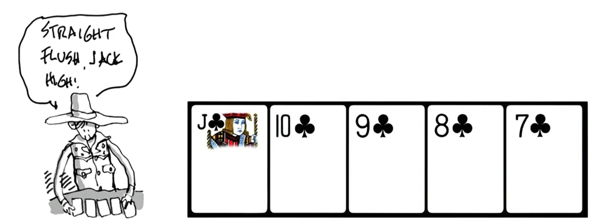
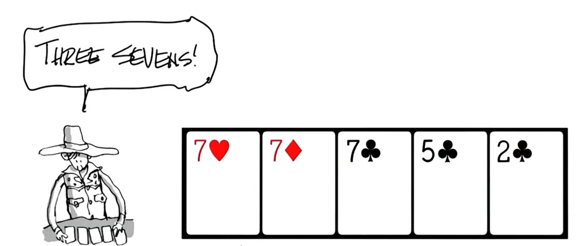
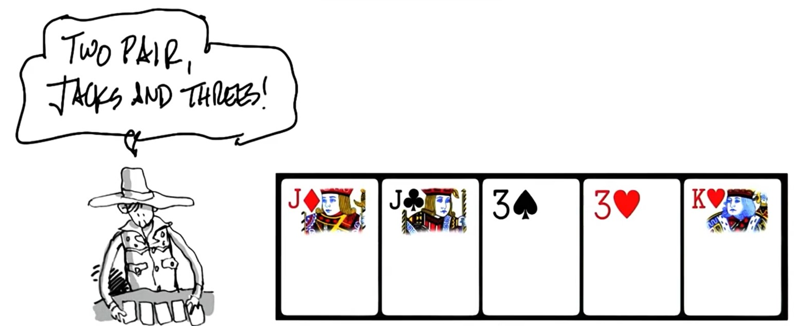
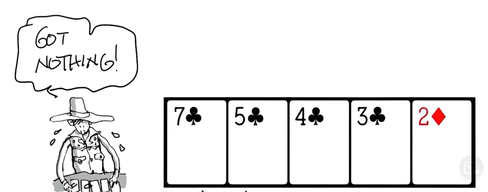

# Winning Poker Hands

# I. Problem description

The Poker game is to find the best hand from a list of hands. The possible functions are:

- poker(hands) function returns the best hand
- hand_rank(hand) function take hand as input and output the hand ranking

To solve this problem, we need to figure out how to represent hand and rank the hand. The basic concepts are listed as below:
- Poker game has nine ranking categories of hand using standard 52-card deck with black and red suit: black and red jokers act as wild cards
- Hand: a set of cards, e.g., one hand can consist of 5 cards
- Hand representation: 
  - rank: the number on the card "2, 3, 4, 5, 6, 7, 8, 9, 10, Jack (J: 11), Queen (Q: 12), King (K: 13), Ace (A: 14)" 
  - suit: the symbol on the card "Clubs-C(♣), Spades-S (♠), Heart-H (♥), Diamonds-D (♦)"
  - example representation: ['JS', 'JD', '2S', '2C', '7H']

# II. Ranking rules

| Rank | Categories | Example hand |   Hand Representation   | Notes |
| ---- | ---------- | ------------ | ------------------- | ----- |
|  8   | Straight flush |  | (8, 11) | different ranks and in ordered |
|  7   | Four of a kind |  | (7, 14, 12) | four cards with same rank |
|  6   | Full house |  | (6, 8, 13) | three cards with the same rank and two cards with another same rank |
|  5   | Flush |  | (5, [10, 8, 7, 5,3]) | same suits but ranks do not matter |
|  4   | Straight |  | (4, 11) | consecutive ranks but suits do not matter |
|  3   | Three of a kind |  | (3, 7, [7, 7, 7, 5, 2]) | three cards with the same rank |
|  2   | Two pairs |  | (2, 11, 3, [13, 11, 11, 3, 3]) | two cards with the same rank and another two cards with another same rank |
|  1   | One pair |  | (1, 2, [11,6 3, 2, 2]) | only two cards with the same rank |
|  0   | High card |  | (0, 7, 5, 4, 3, 2) | no pairs, no sequential cards |
